# Integration Hub Architecture - Merret Core System

**Date:** January 2026  
**Version:** 1.0

---

## Executive Summary

This document outlines the architecture for an integration hub that connects multiple external systems (Ecom, Farfetch, Enactor, Hospitality, PIM) with the core Merret inventory system. The solution uses Azure services with a microservices architecture to handle:

### Migration Context

**Legacy Architecture (Pre-Migration)**:
- **Order Fulfillment System (OFS)**: Monolithic application with UI, API layer, and SQL Database - all processing in-house
- **Product Management System**: Monolithic application with UI, API layer, and SQL Database - all processing in-house
- **Integration Pattern**: Both systems directly interacted with Merret, using a separate cache database for Merret data
- **Deployment**: On-premises infrastructure
- **Architecture**: Tightly coupled, difficult to scale

**Current Architecture (Post-Migration)**:
- **Microservices-based**: Decoupled services with clear boundaries
- **Event-driven**: Asynchronous communication using Event Grid and Service Bus
- **Cloud-native**: Leveraging Azure PaaS services (Container Apps, Functions, Cosmos DB)
- **Third-party Integration**: Modern integration patterns with external systems via APIs and SFTP
- **Scalability**: Independent scaling per service based on load
- **Resilience**: Built-in retry mechanisms, dead-letter queues, and fault tolerance

---

## Current System Capabilities

The microservices architecture handles:

- **Orders** from Ecom (push) and Farfetch (pull)
- **Transactions** from Enactor (SFTP), Farfetch (SFTP), and Hospitality (pull)
- **Prices** distribution to Enactor and Ecom
- **Products** bidirectional sync with Merret
- **Product Enhancements** distribution to PIM (scheduled daily)

---

## High-Level Architecture

```mermaid
flowchart TB
    subgraph EXT["🌐 EXTERNAL SYSTEMS"]
        direction LR
        ECOM["Ecom<br/>(E-commerce)"]
        FARFETCH["Farfetch<br/>(Marketplace)"]
        ENACTOR["Enactor<br/>(Retail)"]
        HOSP["Hospitality<br/>(POS)"]
        PIM["PIM<br/>(Product Info)"]
    end

    subgraph GATEWAY["🚪 API GATEWAY & INGESTION"]
        direction TB
        APIM["API Management<br/><i>Azure APIM</i>"]
        SFTP["SFTP Servers<br/><i>Enactor, Farfetch</i>"]
        ADF["Data Factory<br/><i>Azure ADF</i><br/>ETL Pipeline"]
    end

    subgraph APIS["🔷 WEB APIs (Container Apps)"]
        direction TB
        ORDERAPI["Order API<br/><i>ASP.NET Web API</i><br/>Scale: 2-10"]
        TXAPI["Transaction API<br/><i>ASP.NET Web API</i><br/>Scale: 1-5"]
        PRODAPI["Product API<br/><i>ASP.NET Web API</i><br/>Scale: 1-5"]
    end

    subgraph WORKERS["⚙️ BACKGROUND WORKERS (Container Apps)"]
        direction TB
        PRICEWORKER["Price Batch Worker<br/><i>Background Service</i><br/>Timer: Every 5 min<br/>Batches of 1000"]
        PRODWORKER["Product Batch Worker<br/><i>Background Service</i><br/>Timer: Daily at 2 AM<br/>Batches of 5000"]
    end

    subgraph FUNCTIONS["⚡ AZURE FUNCTIONS (Serverless)"]
        direction TB
        FARFETCHPOLLER["Farfetch Order Poller<br/><i>Timer Function</i><br/>Every 5 min"]
        HOSPPOLLER["Hospitality TX Poller<br/><i>Timer Function</i><br/>Every 5 min"]
        TXTRANSFORM["TX Transformer<br/><i>Service Bus Function</i><br/>Event-driven"]
        PRICESENDER["Price Batch Sender<br/><i>Service Bus Function</i><br/>Processes batches<br/>Sends files/API"]
        PRODSENDER["Product Batch Sender<br/><i>Service Bus Function</i><br/>Processes batches<br/>Sends files/API"]
    end

    subgraph MESSAGING["📨 MESSAGING & EVENTS"]
        direction TB
        BLOBTX["Blob Storage<br/><i>Transaction Files</i>"]
        BLOBOUT["Blob Storage<br/><i>Outbound Batches</i><br/>Prices, Products"]
        EG["Event Grid<br/><i>Blob Events</i>"]
        SBQ["Service Bus Queue<br/><i>transaction-queue</i>"]
        SBT1["Service Bus Queue<br/><i>price-batches</i><br/>Batch metadata"]
        SBT2["Service Bus Queue<br/><i>product-batches</i><br/>Batch metadata"]
    end

    subgraph CORE["💾 CORE SYSTEMS & DATABASES"]
        direction TB
        MERRETDB[("Merret Database<br/><i>3rd Party Inventory DB</i><br/><b>CORE SYSTEM</b><br/>SQL Server<br/>Direct queries from APIs")]
        COSMOS[("Cosmos DB<br/><i>NoSQL Database</i><br/>Transaction Reporting")]
    end

    subgraph SECURITY["🔒 SECURITY & MONITORING"]
        direction LR
        KV["Key Vault<br/><i>Secrets</i>"]
        AI["Application Insights<br/><i>APM & Logs</i>"]
    end

    %% Inbound Order Flows (BLUE)
    ECOM -->|"1. POST Orders"| APIM
    APIM --> ORDERAPI
    FARFETCH -.->|"2. Pull Orders"| FARFETCHPOLLER
    FARFETCHPOLLER -->|"POST"| ORDERAPI
    ORDERAPI ==>|"Direct SQL Query"| MERRETDB

    %% Inbound Transaction Flows (ORANGE)
    ENACTOR & FARFETCH -->|"3. Upload Files"| SFTP
    SFTP --> ADF
    ADF --> BLOBTX
    BLOBTX --> EG
    EG --> SBQ
    SBQ --> TXTRANSFORM
    TXTRANSFORM -->|"POST"| TXAPI
    
    HOSP -.->|"4. Pull TXs"| HOSPPOLLER
    HOSPPOLLER -->|"POST"| TXAPI
    TXAPI ==>|"Direct SQL Query"| MERRETDB
    TXAPI -->|"Save"| COSMOS

    %% Bidirectional Product Flow (GREEN)
    APIM <-->|"5. GET/POST"| PRODAPI
    PRODAPI <===>|"Direct SQL Query"| MERRETDB

    %% Outbound Price Flow with BATCHING (PURPLE)
    PRICEWORKER -.->|"6a. Read Prices<br/>Every 5 min<br/>SQL Query"| MERRETDB
    PRICEWORKER -->|"6b. Write batch file"| BLOBOUT
    PRICEWORKER -->|"6c. Send batch metadata"| SBT1
    SBT1 --> PRICESENDER
    PRICESENDER -->|"6d. Read batch file"| BLOBOUT
    PRICESENDER -->|"6e. Upload to SFTP"| ENACTOR
    PRICESENDER -->|"6f. Upload to SFTP"| ECOM

    %% Outbound Product Enhancement Flow with BATCHING (TEAL)
    PRODWORKER -.->|"7a. Read Products<br/>Daily 2 AM<br/>SQL Query"| MERRETDB
    PRODWORKER -->|"7b. Write batch file"| BLOBOUT
    PRODWORKER -->|"7c. Send batch metadata"| SBT2
    SBT2 --> PRODSENDER
    PRODSENDER -->|"7d. Read batch file"| BLOBOUT
    PRODSENDER -->|"7e. Upload to SFTP"| PIM

    %% Security & Monitoring (GRAY)
    APIS & WORKERS & FUNCTIONS -.->|"Telemetry"| AI
    APIS & WORKERS & FUNCTIONS -.->|"Get Secrets"| KV

    %% Styling
    style MERRETDB fill:#ff6b6b,stroke:#333,stroke-width:4px
    style APIM fill:#4ecdc4,stroke:#333,stroke-width:2px
    style COSMOS fill:#f38181,stroke:#333,stroke-width:2px
    style EXT fill:#e8f5e9,stroke:#2e7d32,stroke-width:2px
    style CORE fill:#ffebee,stroke:#c62828,stroke-width:2px
    style APIS fill:#e3f2fd,stroke:#1565c0,stroke-width:2px
    style WORKERS fill:#fff3e0,stroke:#e65100,stroke-width:2px
    style FUNCTIONS fill:#f3e5f5,stroke:#6a1b9a,stroke-width:2px
    style MESSAGING fill:#e0f2f1,stroke:#00695c,stroke-width:2px
    style BLOBOUT fill:#fff9c4,stroke:#f57f17,stroke-width:2px

    %% Link Styles - Color Coded & Thick
    %% Order Flows (BLUE - #2196F3)
    linkStyle 0 stroke:#2196F3,stroke-width:4px
    linkStyle 1 stroke:#2196F3,stroke-width:4px
    linkStyle 2 stroke:#2196F3,stroke-width:3px,stroke-dasharray:5
    linkStyle 3 stroke:#2196F3,stroke-width:4px
    linkStyle 4 stroke:#2196F3,stroke-width:4px
    linkStyle 5 stroke:#2196F3,stroke-width:5px
    
    %% Transaction Flows (ORANGE - #FF9800)
    linkStyle 6 stroke:#FF9800,stroke-width:4px
    linkStyle 7 stroke:#FF9800,stroke-width:4px
    linkStyle 8 stroke:#FF9800,stroke-width:4px
    linkStyle 9 stroke:#FF9800,stroke-width:4px
    linkStyle 10 stroke:#FF9800,stroke-width:4px
    linkStyle 11 stroke:#FF9800,stroke-width:4px
    linkStyle 12 stroke:#FF9800,stroke-width:4px
    linkStyle 13 stroke:#FF9800,stroke-width:3px,stroke-dasharray:5
    linkStyle 14 stroke:#FF9800,stroke-width:4px
    linkStyle 15 stroke:#FF9800,stroke-width:4px
    linkStyle 16 stroke:#FF9800,stroke-width:5px
    linkStyle 17 stroke:#FF9800,stroke-width:4px
    
    %% Product Flows (GREEN - #4CAF50)
    linkStyle 18 stroke:#4CAF50,stroke-width:4px
    linkStyle 19 stroke:#4CAF50,stroke-width:4px
    linkStyle 20 stroke:#4CAF50,stroke-width:5px
    
    %% Price Flows with Batching (PURPLE - #9C27B0)
    linkStyle 21 stroke:#9C27B0,stroke-width:3px,stroke-dasharray:5
    linkStyle 22 stroke:#9C27B0,stroke-width:3px,stroke-dasharray:5
    linkStyle 23 stroke:#9C27B0,stroke-width:4px
    linkStyle 24 stroke:#9C27B0,stroke-width:4px
    linkStyle 25 stroke:#9C27B0,stroke-width:4px
    linkStyle 26 stroke:#9C27B0,stroke-width:3px,stroke-dasharray:5
    linkStyle 27 stroke:#9C27B0,stroke-width:4px
    linkStyle 28 stroke:#9C27B0,stroke-width:4px
    
    %% Product Enhancement Flows with Batching (TEAL - #009688)
    linkStyle 29 stroke:#009688,stroke-width:3px,stroke-dasharray:5
    linkStyle 30 stroke:#009688,stroke-width:3px,stroke-dasharray:5
    linkStyle 31 stroke:#009688,stroke-width:4px
    linkStyle 32 stroke:#009688,stroke-width:4px
    linkStyle 33 stroke:#009688,stroke-width:4px
    linkStyle 34 stroke:#009688,stroke-width:3px,stroke-dasharray:5
    linkStyle 35 stroke:#009688,stroke-width:4px
    
    %% Monitoring/Security (GRAY - #757575)
    linkStyle 36 stroke:#757575,stroke-width:2px,stroke-dasharray:3
    linkStyle 37 stroke:#757575,stroke-width:2px,stroke-dasharray:3
```

---

## Scalability & Batching Strategy

### Why Batching is Essential

**Problem**: Sending thousands/millions of individual messages through Service Bus → Azure Functions is:
- ❌ Expensive (high function execution costs)
- ❌ Slow (network overhead per message)
- ❌ Inefficient (Service Bus message limits: 256KB standard, 1MB premium)
- ❌ Hard to manage (tracking individual message failures)

**Solution**: Batch processing pattern

### Batch Processing Architecture

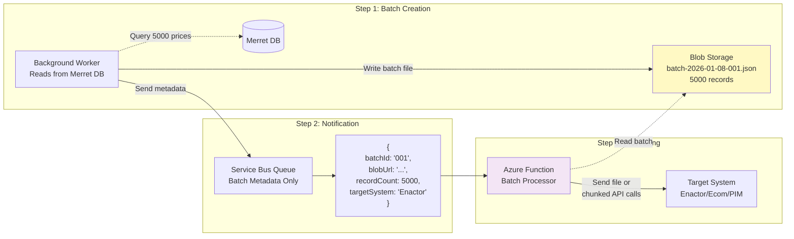

### Batch Sizes & Performance

| Data Type | Records per Batch | File Size | Frequency | Processing Time |
|-----------|-------------------|-----------|-----------|-----------------|
| **Prices** | 1,000-5,000 | ~1-5 MB | Every 5 min | 10-30 seconds |
| **Products** | 5,000-10,000 | ~5-10 MB | Daily | 1-3 minutes |
| **Transactions** | 1,000 | ~500KB-2MB | Per file | 5-15 seconds |

### Delivery Methods

#### Option 1: File-Based Delivery (Recommended for large batches)

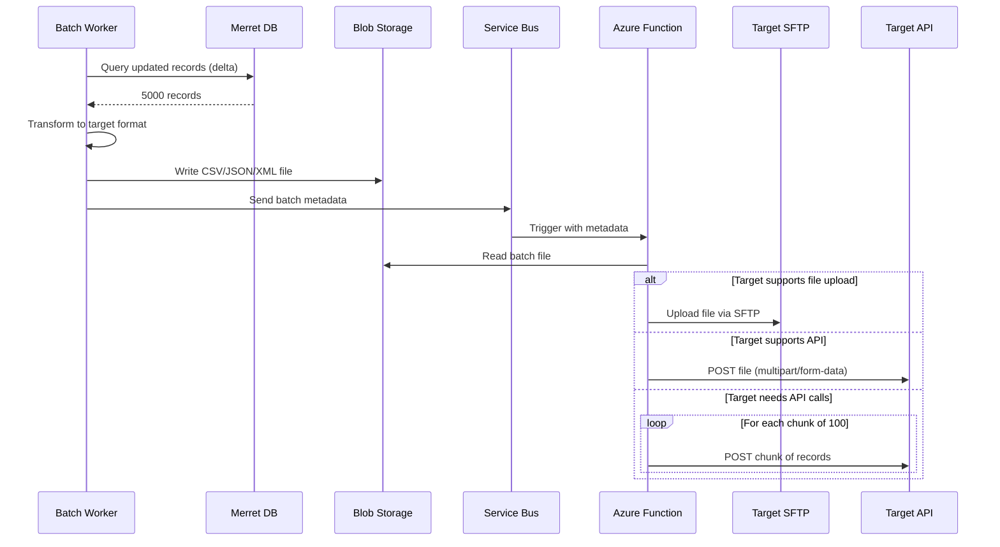

**When to use**:
- Target system has SFTP
- Target system accepts file uploads (multipart)
- Large batches (>1000 records)
- Target system prefers batch files

**File formats**:
- **CSV**: Enactor (simple, compact)
- **JSON**: PIM, Ecom (structured, easy to parse)
- **XML**: Legacy systems

#### Option 2: Chunked API Calls (For systems requiring individual API calls)

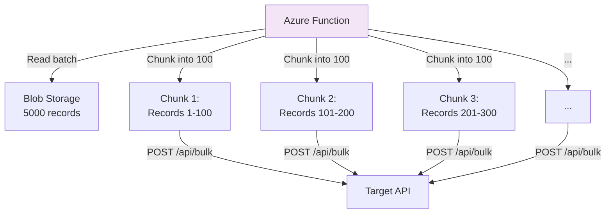

**When to use**:
- Target system requires API calls
- Target system has bulk API endpoint
- Need real-time error handling per chunk

**Implementation**:
```
For batch of 5000 records:
  1. Read from blob
  2. Split into chunks of 100
  3. Send each chunk via HTTP POST
  4. Retry failed chunks
  5. Log results
```

### Scalability Benefits

| Metric | Without Batching | With Batching | Improvement |
|--------|------------------|---------------|-------------|
| **Messages/day** | 1,000,000 | 200 (5000/batch) | 99.98% reduction |
| **Function executions** | 1,000,000 | 200 | 99.98% reduction |
| **Cost** | $500-1000/month | $10-20/month | 98% savings |
| **Processing time** | 10-20 hours | 30-60 minutes | 95% faster |
| **Failure tracking** | 1M messages | 200 batches | Much easier |

### Error Handling for Batches

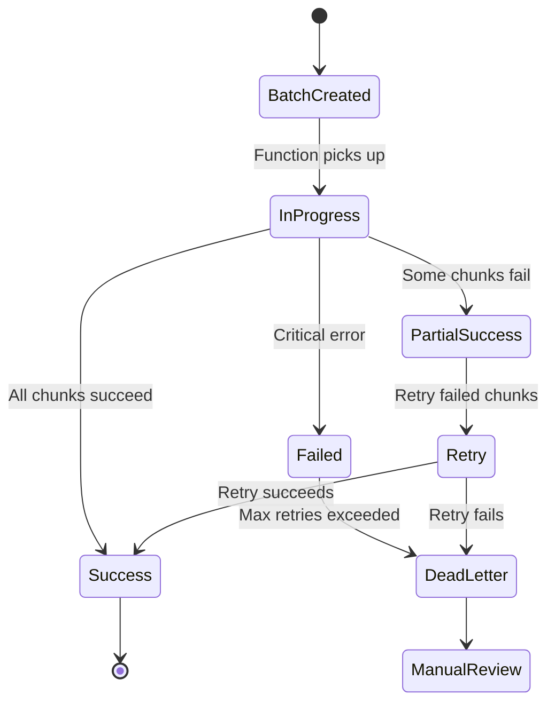

**Error tracking per batch**:
- Batch ID for correlation
- Track successful/failed chunks
- Retry only failed chunks
- Dead letter queue for manual review
- Detailed logging in Application Insights

### Monitoring Batch Processing

**Key Metrics**:
```yaml
Batch Metrics:
  - Batches created per day
  - Average batch size
  - Batch processing duration
  - Success rate per batch
  - Failed chunks per batch

Performance Metrics:
  - Records processed per second
  - Time to process batch
  - Blob read/write latency
  - Target API response time
```

---

## Data Access Pattern: Direct Implementation in Services

### Architecture Decision

**Your Approach: Mixed Data Access** ✅

Each API directly implements data access in the service layer because you have **multiple integration methods** with Merret:
- ✅ **Direct DB writes** (SQL queries) for some operations
- ✅ **File drops** to Merret's SFTP/folder for other operations
- ✅ No repository abstraction needed (adds unnecessary complexity)

**Why No Repository Pattern**:
- Different operations use different methods (DB vs file)
- Repository pattern assumes consistent data access
- Simpler to maintain without the abstraction layer
- Each service knows exactly what it needs to do

### Project Structure for Each API

```
OrderApi/
├── Controllers/
│   └── OrdersController.cs
├── Services/
│   ├── OrderService.cs (business logic + data access)
│   └── MerretFileService.cs (file drop helper)
├── Models/
│   ├── Order.cs
│   └── OrderRequest.cs
└── Program.cs
```

### Implementation Pattern

#### Service with Direct DB Access (OrderService.cs)

```csharp
public class OrderService
{
    private readonly IConfiguration _configuration;
    private readonly ILogger<OrderService> _logger;
    private readonly IDbConnection _merretConnection;
    
    public OrderService(
        IConfiguration configuration,
        ILogger<OrderService> logger)
    {
        _configuration = configuration;
        _logger = logger;
        
        // Direct connection to Merret DB
        _merretConnection = new SqlConnection(
            configuration["Merret:ConnectionString"]
        );
    }
    
    public async Task<OrderResult> CreateOrderAsync(OrderRequest request)
    {
        // Validate
        if (!IsValidOrder(request))
            throw new ValidationException("Invalid order");
        
        // Direct SQL insert
        const string sql = @"
            INSERT INTO Orders (OrderId, CustomerId, OrderDate, TotalAmount, Status)
            VALUES (@OrderId, @CustomerId, @OrderDate, @TotalAmount, 'Created');
            
            SELECT CAST(SCOPE_IDENTITY() as int);";
        
        try
        {
            var orderId = await _merretConnection.ExecuteScalarAsync<int>(sql, new
            {
                OrderId = Guid.NewGuid().ToString(),
                CustomerId = request.CustomerId,
                OrderDate = DateTime.UtcNow,
                TotalAmount = request.TotalAmount
            });
            
            _logger.LogInformation("Created order {OrderId}", orderId);
            
            return new OrderResult { OrderId = orderId, Status = "Success" };
        }
        catch (SqlException ex)
        {
            _logger.LogError(ex, "Failed to create order");
            throw;
        }
    }
    
    public async Task<Order> GetOrderAsync(string orderId)
    {
        const string sql = "SELECT * FROM Orders WHERE OrderId = @OrderId";
        return await _merretConnection.QuerySingleOrDefaultAsync<Order>(
            sql, new { OrderId = orderId });
    }
}
```

#### Service with File Drop (TransactionService.cs)

```csharp
public class TransactionService
{
    private readonly IConfiguration _configuration;
    private readonly ILogger<TransactionService> _logger;
    private readonly BlobServiceClient _blobClient;
    
    public TransactionService(
        IConfiguration configuration,
        ILogger<TransactionService> logger,
        BlobServiceClient blobClient)
    {
        _configuration = configuration;
        _logger = logger;
        _blobClient = blobClient;
    }
    
    public async Task<TransactionResult> CreateTransactionAsync(TransactionRequest request)
    {
        // Validate
        if (!IsValidTransaction(request))
            throw new ValidationException("Invalid transaction");
        
        // Option 1: Write to DB directly (for real-time transactions)
        if (request.RequiresImmediateProcessing)
        {
            return await WriteTransactionToDbAsync(request);
        }
        
        // Option 2: Drop file to Merret's inbound folder (for batch processing)
        else
        {
            return await DropTransactionFileAsync(request);
        }
    }
    
    private async Task<TransactionResult> WriteTransactionToDbAsync(TransactionRequest request)
    {
        using var connection = new SqlConnection(
            _configuration["Merret:ConnectionString"]);
        
        const string sql = @"
            INSERT INTO Transactions 
            (TransactionId, Amount, Date, Type, CustomerId, Status)
            VALUES (@Id, @Amount, @Date, @Type, @CustomerId, 'Pending')";
        
        await connection.ExecuteAsync(sql, new
        {
            Id = request.TransactionId,
            Amount = request.Amount,
            Date = request.Date,
            Type = request.Type,
            CustomerId = request.CustomerId
        });
        
        return new TransactionResult { TransactionId = request.TransactionId };
    }
    
    private async Task<TransactionResult> DropTransactionFileAsync(TransactionRequest request)
    {
        // Create CSV file content
        var csv = $"{request.TransactionId},{request.Amount},{request.Date:yyyy-MM-dd}," +
                  $"{request.Type},{request.CustomerId}\n";
        
        // Drop to Merret's inbound blob container
        var containerClient = _blobClient.GetBlobContainerClient("merret-inbound");
        var blobName = $"transactions/tx_{DateTime.UtcNow:yyyyMMddHHmmss}_{request.TransactionId}.csv";
        var blobClient = containerClient.GetBlobClient(blobName);
        
        using var stream = new MemoryStream(Encoding.UTF8.GetBytes(csv));
        await blobClient.UploadAsync(stream, overwrite: false);
        
        _logger.LogInformation("Dropped transaction file {FileName}", blobName);
        
        return new TransactionResult 
        { 
            TransactionId = request.TransactionId,
            Status = "FileDropped"
        };
    }
}
```

#### Helper Service for File Operations (MerretFileService.cs)

```csharp
public class MerretFileService
{
    private readonly BlobServiceClient _blobClient;
    private readonly ILogger<MerretFileService> _logger;
    private readonly string _merretInboundContainer;
    
    public MerretFileService(
        BlobServiceClient blobClient,
        IConfiguration configuration,
        ILogger<MerretFileService> logger)
    {
        _blobClient = blobClient;
        _logger = logger;
        _merretInboundContainer = configuration["Merret:InboundContainer"];
    }
    
    public async Task<string> DropCsvFileAsync(string folderName, List<Dictionary<string, object>> records)
    {
        // Generate CSV
        var csv = GenerateCsv(records);
        
        // Upload to blob
        var fileName = $"{folderName}/import_{DateTime.UtcNow:yyyyMMddHHmmss}.csv";
        var containerClient = _blobClient.GetBlobContainerClient(_merretInboundContainer);
        var blobClient = containerClient.GetBlobClient(fileName);
        
        using var stream = new MemoryStream(Encoding.UTF8.GetBytes(csv));
        await blobClient.UploadAsync(stream);
        
        _logger.LogInformation("Dropped file {FileName} with {Count} records", 
            fileName, records.Count);
        
        return fileName;
    }
    
    public async Task<string> DropJsonFileAsync(string folderName, object data)
    {
        var json = JsonSerializer.Serialize(data, new JsonSerializerOptions 
        { 
            WriteIndented = true 
        });
        
        var fileName = $"{folderName}/import_{DateTime.UtcNow:yyyyMMddHHmmss}.json";
        var containerClient = _blobClient.GetBlobContainerClient(_merretInboundContainer);
        var blobClient = containerClient.GetBlobClient(fileName);
        
        using var stream = new MemoryStream(Encoding.UTF8.GetBytes(json));
        await blobClient.UploadAsync(stream);
        
        return fileName;
    }
    
    private string GenerateCsv(List<Dictionary<string, object>> records)
    {
        if (records.Count == 0) return string.Empty;
        
        var sb = new StringBuilder();
        
        // Header
        var headers = string.Join(",", records[0].Keys);
        sb.AppendLine(headers);
        
        // Rows
        foreach (var record in records)
        {
            var values = string.Join(",", record.Values.Select(v => 
                v?.ToString()?.Replace(",", "\\,") ?? ""));
            sb.AppendLine(values);
        }
        
        return sb.ToString();
    }
}
```

### Dependency Injection (Program.cs)

```csharp
var builder = WebApplication.CreateBuilder(args);

// Configure Key Vault
builder.Configuration.AddAzureKeyVault(
    new Uri(builder.Configuration["KeyVault:VaultUri"]),
    new DefaultAzureCredential());

// Register Blob client for file drops
builder.Services.AddSingleton(sp =>
{
    var connectionString = builder.Configuration["Merret:BlobConnectionString"];
    return new BlobServiceClient(connectionString);
});

// Register services (no repository layer)
builder.Services.AddScoped<OrderService>();
builder.Services.AddScoped<TransactionService>();
builder.Services.AddScoped<ProductService>();
builder.Services.AddScoped<MerretFileService>();

// Register Dapper type handlers if needed
SqlMapper.AddTypeHandler(new JsonTypeHandler());

builder.Services.AddControllers();

var app = builder.Build();
app.MapControllers();
app.Run();
```

### Configuration

**appsettings.json**:
```json
{
  "Merret": {
    "ConnectionString": "Server=merret-db;Database=Merret;...",
    "BlobConnectionString": "DefaultEndpointsProtocol=https;...",
    "InboundContainer": "merret-inbound",
    "InboundFolder": {
      "Orders": "orders",
      "Transactions": "transactions",
      "Products": "products"
    }
  }
}
```

**Azure Key Vault Secrets**:
```
Merret--ConnectionString
Merret--BlobConnectionString
```

### When to Use DB vs File Drop

| Scenario | Method | Reason |
|----------|--------|--------|
| **Real-time orders** | Direct DB | Immediate processing needed |
| **Batch orders** | File drop | Merret processes in batches |
| **Individual transactions** | Direct DB | Real-time inventory update |
| **Bulk transactions** | File drop | Merret's batch import process |
| **Product lookups** | Direct DB | Need immediate response |
| **Product bulk updates** | File drop | Large volume, async processing |
| **Price updates to Merret** | File drop | Merret imports from files |
| **Stock adjustments** | Direct DB | Real-time inventory sync |

### Merret Integration Patterns

#### Pattern 1: Direct DB Write
```
Your API → SQL INSERT/UPDATE → Merret Database → Immediate
```

**Use when**:
- Need immediate confirmation
- Single record operations
- Real-time inventory checks required

#### Pattern 2: File Drop
```
Your API → Generate CSV/JSON → Blob Storage → Merret picks up file → Processes in batch
```

**Use when**:
- Bulk operations (>100 records)
- Merret has scheduled import jobs
- Don't need immediate confirmation
- Merret provides file-based integration

#### Pattern 3: Hybrid (Your Case)
```
Your API decides based on:
- Record count
- Urgency
- Business rules
- Merret's capabilities

Then either:
- Writes to DB directly, OR
- Drops file to blob
```

### Example: Hybrid Transaction Processing

```csharp
public class TransactionService
{
    private const int BATCH_THRESHOLD = 50;
    
    public async Task<TransactionResult> ProcessTransactionsAsync(
        List<Transaction> transactions)
    {
        // Decide based on volume
        if (transactions.Count < BATCH_THRESHOLD)
        {
            // Few transactions - write to DB directly
            return await InsertTransactionsToDbAsync(transactions);
        }
        else
        {
            // Many transactions - drop file for batch import
            return await DropTransactionFileAsync(transactions);
        }
    }
    
    private async Task<TransactionResult> InsertTransactionsToDbAsync(
        List<Transaction> transactions)
    {
        using var connection = new SqlConnection(_connectionString);
        
        const string sql = @"
            INSERT INTO Transactions (TransactionId, Amount, Date, Type)
            VALUES (@TransactionId, @Amount, @Date, @Type)";
        
        // Use Dapper's Execute with IEnumerable
        await connection.ExecuteAsync(sql, transactions);
        
        return new TransactionResult 
        { 
            Count = transactions.Count,
            Method = "DirectDB" 
        };
    }
    
    private async Task<TransactionResult> DropTransactionFileAsync(
        List<Transaction> transactions)
    {
        var fileName = await _fileService.DropCsvFileAsync(
            "transactions",
            transactions.Select(t => new Dictionary<string, object>
            {
                ["TransactionId"] = t.TransactionId,
                ["Amount"] = t.Amount,
                ["Date"] = t.Date,
                ["Type"] = t.Type
            }).ToList()
        );
        
        return new TransactionResult 
        { 
            Count = transactions.Count,
            Method = "FileDrop",
            FileName = fileName
        };
    }
}
```

### Benefits of Direct Service Implementation

✅ **Simpler**: No unnecessary abstraction  
✅ **Flexible**: Easy to switch between DB and file  
✅ **Clear**: Each service knows exactly what it does  
✅ **Maintainable**: Less layers to update  
✅ **Testable**: Mock the database connection or blob client  

### Testing Without Repository Pattern

```csharp
public class OrderServiceTests
{
    [Fact]
    public async Task CreateOrder_WritesToDatabase_ReturnsOrderId()
    {
        // Arrange
        var configuration = new ConfigurationBuilder()
            .AddInMemoryCollection(new Dictionary<string, string>
            {
                ["Merret:ConnectionString"] = "test-connection"
            })
            .Build();
        
        var logger = Mock.Of<ILogger<OrderService>>();
        var service = new OrderService(configuration, logger);
        
        // Act
        var result = await service.CreateOrderAsync(new OrderRequest 
        { 
            CustomerId = "CUST123",
            TotalAmount = 99.99m
        });
        
        // Assert
        Assert.NotNull(result.OrderId);
    }
}

// For integration tests, use Testcontainers with real SQL Server
```

### Summary

**Your simplified approach**:
- ✅ No repository pattern needed
- ✅ Direct implementation in services
- ✅ Mix of DB writes and file drops
- ✅ Each service decides the best method
- ✅ Simpler, clearer, easier to maintain

**What you need**:
- Service layer with direct data access
- Dapper for SQL queries
- BlobServiceClient for file drops
- Helper service for file generation (optional)
- Configuration for both DB and blob connections

---

## 1. Order Flow Architecture

### 1.1 Order Flow Diagram

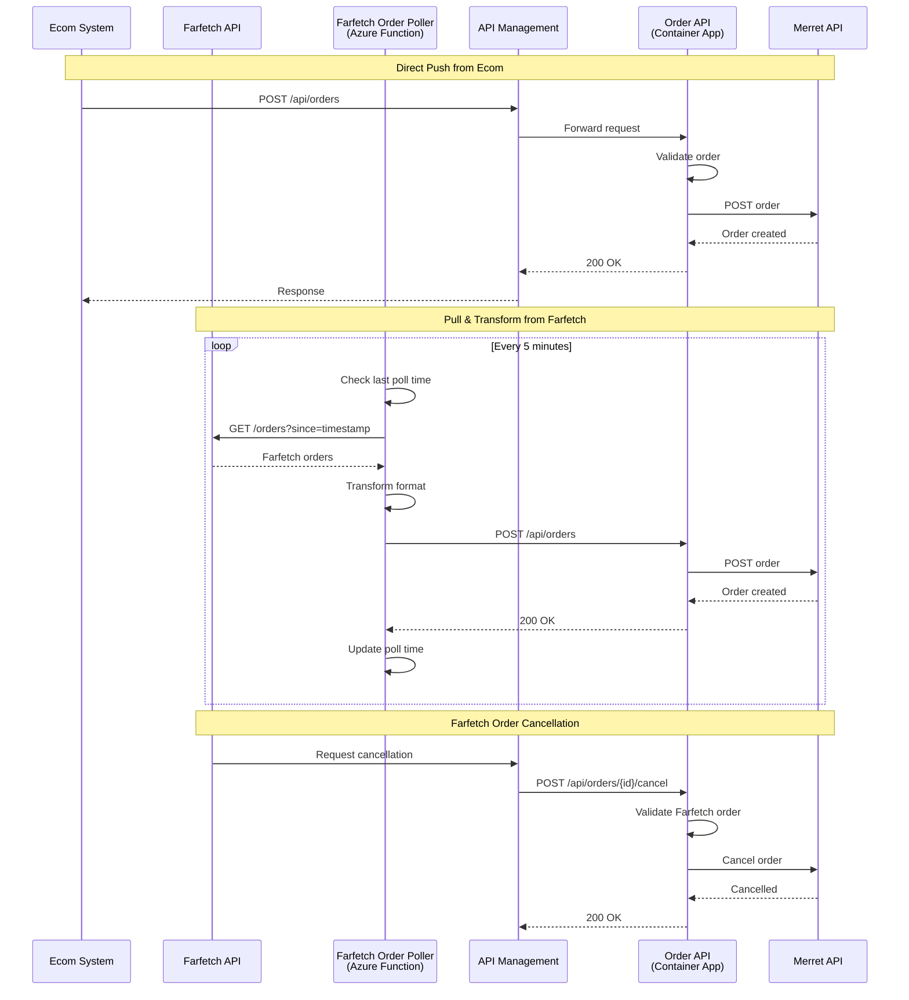

### 1.2 Order API Endpoints

| Endpoint | Method | Source | Purpose |
|----------|--------|--------|---------|
| `/api/orders` | POST | Ecom, Farfetch (via poller) | Create order in Merret |
| `/api/orders/{id}` | GET | All systems | Verify order status (rarely used) |
| `/api/orders/{id}/cancel` | POST | Farfetch only | Cancel Farfetch order |

### 1.3 Order Sources

| System | Integration Method | Format | Frequency | Special Notes |
|--------|-------------------|--------|-----------|---------------|
| **Ecom** | Push (API) | Standard JSON | Real-time | Direct POST to Order API |
| **Farfetch** | Pull (Poller) | Farfetch JSON | Every 5 min | Requires transformation |

### 1.4 Order Cancellation

- **Ecom**: Sends cancelled transaction (no cancellation endpoint needed)
- **Farfetch**: Uses dedicated cancellation endpoint (`POST /api/orders/{id}/cancel`)

---

## 2. Transaction Flow Architecture

### 2.1 Transaction Flow Diagram

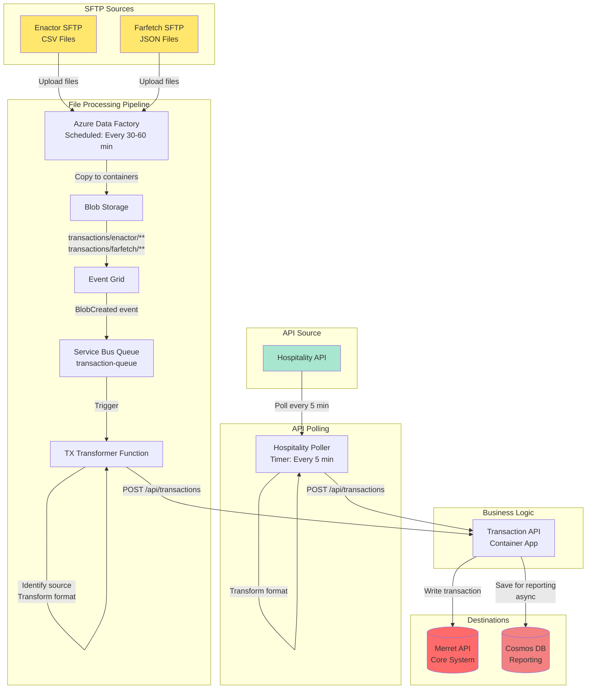

### 2.2 Transaction Sources

| System | Integration Method | Format | Frequency | Container/Path |
|--------|-------------------|--------|-----------|----------------|
| **Enactor** | SFTP → Blob | CSV | Every 30-60 min | `transactions/enactor/` |
| **Farfetch** | SFTP → Blob | JSON | Every 30-60 min | `transactions/farfetch/` |
| **Hospitality** | API Pull | JSON | Every 5 min | N/A (direct API) |

### 2.3 Transaction Processing Flow

#### SFTP-Based (Enactor, Farfetch):
1. External system uploads file to SFTP
2. Azure Data Factory copies file to Blob Storage
3. Event Grid detects blob creation
4. Service Bus receives event
5. Transaction Transformer Function triggered
6. Function identifies source from blob path
7. Function reads and transforms to standard format
8. Function POSTs to Transaction API
9. Transaction API writes to Merret + CosmosDB

#### API-Based (Hospitality):
1. Timer triggers Hospitality Poller (every 5 min)
2. Poller calls Hospitality API
3. Poller transforms to standard format
4. Poller POSTs to Transaction API
5. Transaction API writes to Merret + CosmosDB

### 2.4 Dual Write Pattern

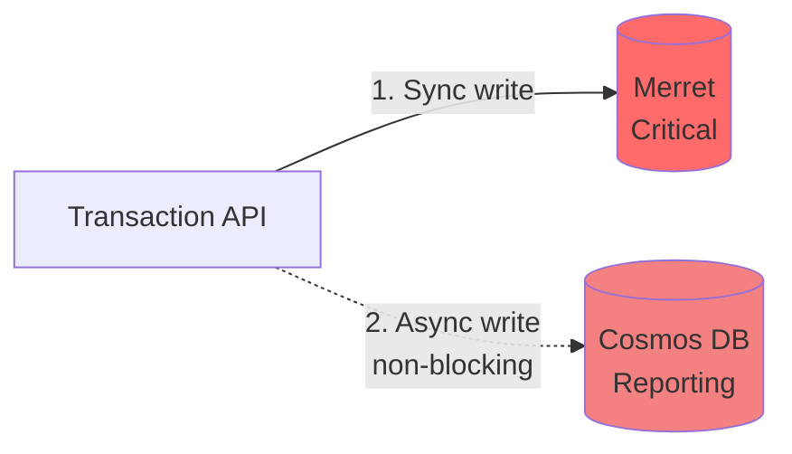

- **Merret**: Synchronous write (critical, must succeed)
- **Cosmos DB**: Asynchronous write (reporting, failure doesn't block request)

---

## 3. Price Distribution Flow

### 3.1 Price Distribution Diagram

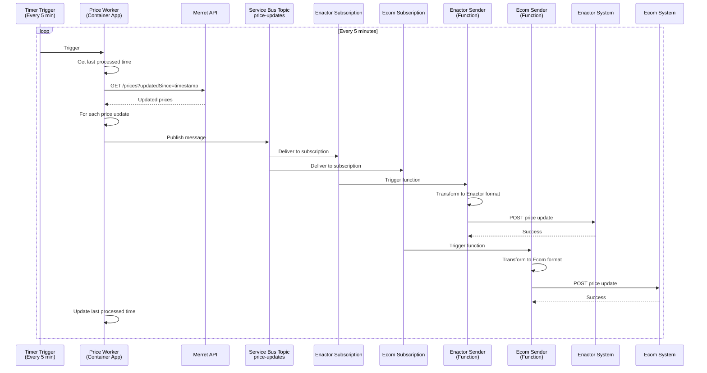

### 3.2 Price Distribution Details

**Source**: Merret (read-only for us)  
**Destinations**: Enactor, Ecom  
**Method**: Scheduled pull + Service Bus fan-out  
**Frequency**: Every 5 minutes

**Flow**:
1. Price Worker reads updated prices from Merret
2. Publishes each price update to Service Bus Topic
3. Two subscriptions (Enactor, Ecom) receive messages independently
4. Each Azure Function transforms and sends to respective system
5. Independent retry and error handling per destination

**Benefits**:
- Decoupled: Enactor failure doesn't affect Ecom
- Scalable: Easy to add more destinations (new subscription + function)
- Resilient: Service Bus handles retries and dead-letter queues

---

## 4. Product Flow

### 4.1 Product Flow Diagram

```mermaid
graph LR
    EXT[External Systems]
    APIM[API Management]
    PRODAPI[Product API<br/>Container App]
    MERRET[(Merret API)]
    
    EXT -->|GET /api/products/{id}| APIM
    APIM -->|Cache: 5 min| PRODAPI
    PRODAPI -->|Read| MERRET
    MERRET -->|Product data| PRODAPI
    PRODAPI -->|Response| APIM
    APIM -->|Cached response| EXT
    
    EXT -->|POST /api/products| APIM
    APIM --> PRODAPI
    PRODAPI -->|Create| MERRET
    MERRET -->|Created| PRODAPI
    PRODAPI -->|Response| EXT
    
    EXT -->|PUT /api/products/{id}| APIM
    APIM --> PRODAPI
    PRODAPI -->|Update| MERRET
    MERRET -->|Updated| PRODAPI
    PRODAPI -->|Response| EXT
    
    style MERRET fill:#ff6b6b
```

### 4.2 Product API Endpoints

| Endpoint | Method | Purpose | Caching |
|----------|--------|---------|---------|
| `/api/products/{id}` | GET | Read product from Merret | 5 min (APIM) |
| `/api/products` | POST | Create product in Merret | No cache |
| `/api/products/{id}` | PUT | Update product in Merret | No cache |

**Characteristics**:
- Bidirectional: Read and write to Merret
- Simple pass-through with validation
- API Management caches GET requests
- Lower traffic compared to Orders/Transactions

---

## 5. Product Enhancement Distribution Flow (PIM)

### 5.1 Product Enhancement Flow Diagram

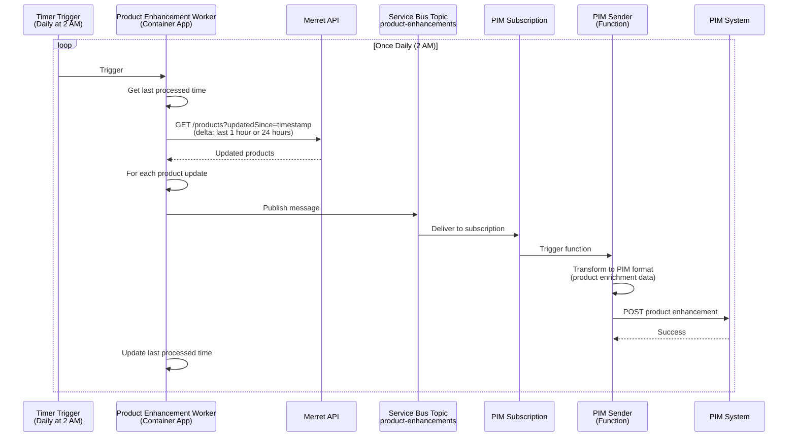

### 5.2 Product Enhancement Distribution Details

**Source**: Merret (product data with enhancements)  
**Destination**: PIM (Product Information Management system)  
**Method**: Scheduled pull (delta) + Service Bus  
**Frequency**: Once daily (typically early morning, e.g., 2 AM)  
**Delta Window**: Can be configured (1 hour or 24 hours)

**Flow**:
1. Product Enhancement Worker triggers once daily (e.g., 2 AM)
2. Reads updated/enhanced products from Merret (delta query)
3. Publishes each product to Service Bus Topic
4. PIM Subscription receives messages
5. Azure Function transforms data to PIM format
6. Function sends enhanced product data to PIM system
7. Worker updates last processed timestamp

**Why Daily?**:
- Product enhancements don't change frequently
- PIM system typically batches updates
- Reduces load on Merret API
- Cost-effective (fewer executions)

**Delta Query Options**:
```
Option 1: Last 1 hour (in case of failures/retries)
GET /products?updatedSince=2026-01-07T01:00:00Z

Option 2: Last 24 hours (standard daily run)
GET /products?updatedSince=2026-01-06T02:00:00Z

Option 3: Full sync (weekly/monthly)
GET /products (all products)
```

### 5.3 PIM Integration Specifics

**Product Enhancement Data Includes**:
- Rich product descriptions
- Marketing content
- SEO metadata
- Product images/videos URLs
- Categories and taxonomies
- Product relationships
- Attributes and specifications

**Why Separate from Product API?**:
- Product API: Transactional (create/update products in Merret)
- PIM Distribution: Informational (send enriched data to PIM for display)
- Different frequency and data payload
- PIM doesn't write back to Merret

---

## 5.4 Background Worker Implementation Details

### Hosting Platform: Azure Container Apps / App Service

**Technology Stack**:
- .NET 8 Worker Service (`BackgroundService`)
- Docker containerized
- Platform: Azure Container Apps (recommended) or Azure App Service

**Why Container Apps vs App Service**:

| Aspect | Container Apps | App Service |
|--------|---------------|-------------|
| **Cost** | ~$30-50/month (pay for usage) | ~$55-200/month (always on) |
| **Scale to Zero** | ✅ Yes (if needed) | ❌ No |
| **Container Native** | ✅ Built for it | ⚠️ Supported |
| **Maturity** | 3+ years (GA: May 2022) | 15+ years |
| **Cold Starts** | ⚠️ Yes (if scale to 0) | ✅ No (Always On) |

**Recommendation for 2023-24 timeframe**: 
- Azure App Service (more mature, widely adopted)
- Container Apps (if bleeding-edge adoption is credible)
- **Note**: The application code is identical for both platforms

### Worker Architecture Pattern

```csharp
// PriceBatchWorker.cs
public class PriceBatchWorker : BackgroundService
{
    private readonly ILogger<PriceBatchWorker> _logger;
    private readonly IMerretApiClient _merretClient;
    private readonly BlobContainerClient _blobContainer;
    private readonly ServiceBusClient _serviceBusClient;
    
    private readonly TimeSpan _timerInterval = TimeSpan.FromMinutes(5);
    private const int BATCH_SIZE = 1000;
    
    protected override async Task ExecuteAsync(CancellationToken stoppingToken)
    {
        _logger.LogInformation("Worker starting at: {time}", DateTimeOffset.UtcNow);
        
        try
        {
            // Continuous loop with cancellation support
            while (!stoppingToken.IsCancellationRequested)
            {
                try
                {
                    await ProcessPriceBatchAsync(stoppingToken);
                }
                catch (Exception ex)
                {
                    _logger.LogError(ex, "Error processing batch");
                }
                
                // Delay respects cancellation token
                await Task.Delay(_timerInterval, stoppingToken);
            }
        }
        catch (TaskCanceledException) when (stoppingToken.IsCancellationRequested)
        {
            // Expected during graceful shutdown - not an error
            _logger.LogInformation("Worker stopping gracefully");
        }
        
        _logger.LogInformation("Worker stopped at: {time}", DateTimeOffset.UtcNow);
    }
    
    private async Task ProcessPriceBatchAsync(CancellationToken cancellationToken)
    {
        // 1. Query database for updated prices
        var lastProcessedTime = await GetLastProcessedTimestampAsync();
        var prices = await _merretClient.GetUpdatedPricesAsync(
            lastProcessedTime, 
            BATCH_SIZE, 
            cancellationToken);
        
        if (prices.Count == 0) return;
        
        // 2. Write batch to Blob Storage
        var batchId = Guid.NewGuid().ToString();
        var blobName = $"batch-{DateTime.UtcNow:yyyy-MM-dd-HHmmss}-{batchId}.json";
        await WriteBatchToBlobAsync(blobName, prices, cancellationToken);
        
        // 3. Send metadata to Service Bus
        var metadata = new BatchMetadata
        {
            BatchId = batchId,
            BlobName = blobName,
            RecordCount = prices.Count,
            TargetSystems = new[] { "Enactor", "Ecom" }
        };
        await SendBatchMetadataAsync(metadata, cancellationToken);
        
        // 4. Update last processed timestamp
        await SaveLastProcessedTimestampAsync(DateTimeOffset.UtcNow);
    }
}
```

### Graceful Shutdown & Cancellation Handling

**How Cancellation Works**:

```
Azure/Host sends shutdown signal (SIGTERM)
    ↓
.NET Generic Host receives signal
    ↓
Host cancels the CancellationToken
    ↓
stoppingToken.IsCancellationRequested = true
    ↓
Worker checks flag in while loop
    ↓
Loop exits (doesn't start new iteration)
    ↓
ExecuteAsync completes
    ↓
Container stops gracefully
```

**Key Design Decisions**:

1. **Check cancellation BEFORE starting new work**
   ```csharp
   while (!stoppingToken.IsCancellationRequested)  // ← Gate prevents new work
   {
       await ProcessBatchAsync(stoppingToken);
   }
   ```

2. **Pass cancellation token to all async operations**
   ```csharp
   await _httpClient.GetAsync(url, cancellationToken);  // Respects cancellation
   await Task.Delay(interval, cancellationToken);       // Respects cancellation
   await _blobClient.UploadAsync(data, cancellationToken); // Respects cancellation
   ```

3. **Configure graceful shutdown timeout**
   ```csharp
   // Program.cs
   services.Configure<HostOptions>(options =>
   {
       options.ShutdownTimeout = TimeSpan.FromSeconds(30);  // Grace period
   });
   ```

**Graceful Shutdown Timeline**:
```
Time 0s:   Shutdown signal received
           → CancellationToken cancelled
           → "Please stop gracefully"
           
Time 0-30s: Grace period
           → Worker finishes current batch processing
           → Cleans up resources
           → Exits loop naturally
           
Time 30s:  Timeout reached
           → If still running: FORCEFULLY KILLED (SIGKILL)
           → Risk of data inconsistency
```

**Why This Pattern Matters**:
- ✅ **No duplicate processing**: Worker doesn't start new batch during shutdown
- ✅ **Data consistency**: Current batch completes successfully
- ✅ **Clean deployments**: Zero-downtime deployments possible
- ✅ **Resource cleanup**: Connections, files properly closed

### Scaling Strategy: Why Workers Are Singletons

**Configuration**:
```yaml
scale:
  minReplicas: 1  # Always running
  maxReplicas: 1  # SINGLETON - no horizontal scaling
```

**Why NOT Scale to Multiple Instances?**

❌ **Problem with Multiple Instances**:
```
Instance 1: Queries DB → Gets records 1-1000
Instance 2: Queries DB → Gets records 1-1000 (DUPLICATE!)
Instance 3: Queries DB → Gets records 1-1000 (DUPLICATE!)

Issues:
- All instances execute SAME database query
- Same records processed multiple times
- Race conditions on "last processed timestamp"
- 3x database load with 0x performance benefit
- Wasted CPU, memory, storage
```

✅ **Correct Pattern: Single Worker + Auto-Scaling Functions**:
```
Worker (1 instance):
  → Queries DB once (1000 records)
  → Creates batch file
  → Sends metadata to Service Bus
  
Azure Functions (Auto-scale):
  → Instance 1: Processes batch for Enactor
  → Instance 2: Processes batch for Ecom
  → Instance 3: Processes next batch
  (Functions scale based on queue depth!)
```

**The Bottleneck**:
- ❌ NOT CPU (worker mostly sleeps)
- ❌ NOT Memory (lightweight processing)
- ✅ **Database Query** (all instances would run same query)

**When to Scale Workers**:
- ✅ **Partitioned data**: Different workers handle different regions/customers
- ✅ **CPU-bound work**: Image processing, encryption, compression
- ✅ **Independent data sources**: Each worker queries different database

**When NOT to Scale Workers**:
- ❌ **Single data source**: All instances query same database
- ❌ **Sequential processing**: Work must be done in order
- ❌ **Shared state**: Coordination required between instances

### Deployment Configuration

**Container Apps (Bicep)**:
```bicep
resource priceWorker 'Microsoft.App/containerApps@2023-05-01' = {
  name: 'price-worker'
  properties: {
    configuration: {
      activeRevisionsMode: 'Single'
      secrets: [
        { name: 'storage-connection', value: storageConnectionString }
        { name: 'servicebus-connection', value: serviceBusConnectionString }
      ]
    }
    template: {
      scale: {
        minReplicas: 1
        maxReplicas: 1  // Singleton
      }
      containers: [{
        name: 'price-worker'
        image: 'myregistry.azurecr.io/price-worker:latest'
        resources: {
          cpu: 0.5
          memory: '1Gi'
        }
        env: [
          { name: 'AzureStorage__ConnectionString', secretRef: 'storage-connection' }
          { name: 'ServiceBus__ConnectionString', secretRef: 'servicebus-connection' }
        ]
      }]
    }
  }
}
```

**App Service (Bicep)**:
```bicep
resource priceWorker 'Microsoft.Web/sites@2022-03-01' = {
  name: 'price-worker'
  properties: {
    serverFarmId: appServicePlan.id
    siteConfig: {
      linuxFxVersion: 'DOCKER|myregistry.azurecr.io/price-worker:latest'
      alwaysOn: true  // Keep worker running continuously
      appSettings: [
        { name: 'AzureStorage__ConnectionString', value: storageConnectionString }
        { name: 'ServiceBus__ConnectionString', value: serviceBusConnectionString }
      ]
    }
  }
}
```

**Note**: The application code is 100% identical for both platforms - only the infrastructure configuration differs.

### Monitoring & Observability

**Key Metrics to Track**:
```
Worker Health:
  - Worker uptime
  - Last successful batch processing time
  - Exceptions in worker loop
  - Graceful shutdown success rate

Batch Metrics:
  - Batches created per day
  - Average batch size
  - Time to create batch
  - Database query duration

Processing Metrics:
  - Service Bus queue depth
  - Function execution count
  - Success/failure rate per batch
```

**Application Insights Queries**:
```kusto
// Worker execution times
traces
| where customDimensions.CategoryName == "PriceBatchWorker"
| where message contains "completed"
| extend duration = todouble(customDimensions.duration)
| summarize avg(duration), max(duration) by bin(timestamp, 1h)

// Graceful shutdowns
traces
| where message contains "Worker stopping gracefully"
| summarize count() by bin(timestamp, 1d)

// Batch sizes
traces
| where message contains "Found" and message contains "price updates"
| extend count = extract(@"Found (\d+) price", 1, message)
| summarize avg(todouble(count)), max(todouble(count)) by bin(timestamp, 1h)
```

---

## 6. Azure Resources Architecture

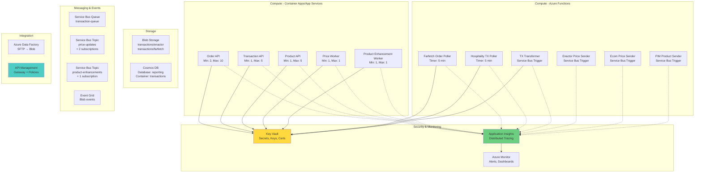

### 5.1 Azure Resources Summary

#### Compute Services

| Service | Count | Purpose | Scaling |
|---------|-------|---------|---------|
| **Container Apps / App Services** | 5 | APIs + Workers | Auto-scale |
| - Order API | 1 | Order processing | Min: 2, Max: 10 |
| - Transaction API | 1 | Transaction processing | Min: 1, Max: 5 |
| - Product API | 1 | Product CRUD | Min: 1, Max: 5 |
| - Price Worker | 1 | Price distribution | Min: 1, Max: 1 (singleton) |
| - Product Enhancement Worker | 1 | Product distribution to PIM | Min: 1, Max: 1 (singleton) |
| **Azure Functions** | 6 | Pollers + Transformers + Senders | Consumption Plan |
| - Farfetch Order Poller | 1 | Pull orders every 5 min | Auto-scale |
| - Hospitality TX Poller | 1 | Pull transactions every 5 min | Auto-scale |
| - TX Transformer | 1 | Transform SFTP files | Event-driven |
| - Enactor Price Sender | 1 | Send prices to Enactor | Event-driven |
| - Ecom Price Sender | 1 | Send prices to Ecom | Event-driven |
| - PIM Product Sender | 1 | Send product enhancements to PIM | Event-driven |

#### Storage & Data

| Service | Purpose | Configuration |
|---------|---------|---------------|
| **Blob Storage** | Transaction files | Containers: `transactions/enactor`, `transactions/farfetch` |
| **Cosmos DB** | Transaction reporting | NoSQL API, Partition Key: TransactionId, Autoscale: 400-4000 RU/s |

#### Messaging & Events

| Service | Purpose | Configuration |
|---------|---------|---------------|
| **Service Bus Queue** | Transaction processing | Queue: `transaction-queue`, Max Delivery: 5, DLQ enabled |
| **Service Bus Topic** | Price distribution | Topic: `price-updates`, Subscriptions: `enactor-price-sub`, `ecom-price-sub` |
| **Service Bus Topic** | Product enhancement distribution | Topic: `product-enhancements`, Subscription: `pim-product-sub` |
| **Event Grid** | Blob events | Filter: BlobCreated in transactions/** |

#### Integration

| Service | Purpose |
|---------|---------|
| **Azure Data Factory** | SFTP → Blob copy (scheduled) |
| **API Management** | Gateway, authentication, rate limiting, caching |

#### Security & Monitoring

| Service | Purpose |
|---------|---------|
| **Key Vault** | Store all secrets, connection strings, API keys |
| **Application Insights** | Distributed tracing, metrics, logs |
| **Azure Monitor** | Alerts, dashboards, log analytics |

---

## 6. Integration Matrix

### 6.1 External System Connections

| System | Direction | Data Type | Method | Frequency | Format | Notes |
|--------|-----------|-----------|--------|-----------|--------|-------|
| **Ecom** | Inbound | Orders | Push (API) | Real-time | JSON | Direct POST to Order API |
| **Ecom** | Inbound | Cancelled TX | Push (API) | Real-time | JSON | Sends cancelled transaction |
| **Ecom** | Outbound | Prices | Push (Service Bus) | Every 5 min | JSON | Via Azure Function |
| **Farfetch** | Inbound | Orders | Pull (API) | Every 5 min | JSON | Requires transformation |
| **Farfetch** | Inbound | Transactions | Pull (SFTP) | Every 30-60 min | JSON | Via ADF → Blob |
| **Farfetch** | Bidirectional | Cancellation | API | Real-time | JSON | Special endpoint for Farfetch only |
| **Enactor** | Inbound | Transactions | Pull (SFTP) | Every 30-60 min | CSV | Via ADF → Blob |
| **Enactor** | Outbound | Prices | Push (Service Bus) | Every 5 min | JSON | Via Azure Function |
| **Hospitality** | Inbound | Transactions | Pull (API) | Every 5 min | JSON | Requires transformation |
| **PIM** | Outbound | Product Enhancements | Push (Service Bus) | Daily (2 AM) | JSON | Enriched product data |
| **Merret DB** | Bidirectional | All | Database | Real-time | SQL | Core inventory database (via data service layer) |

### 6.2 Data Flow Direction Map

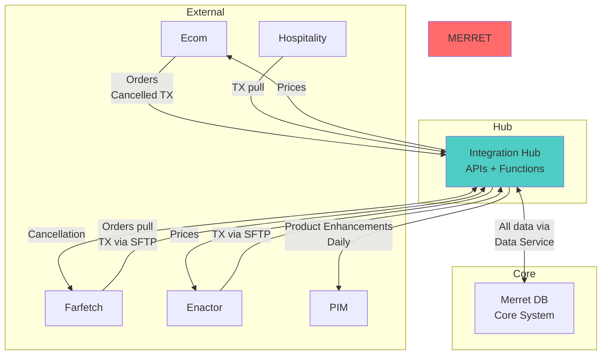

---

## 7. Resilience & Error Handling

### 7.1 Retry Strategies

| Component | Retry Policy | Max Retries | Backoff |
|-----------|-------------|-------------|---------|
| **Service Bus** | Exponential | 5 | 2^n seconds |
| **HTTP Clients** | Exponential (Polly) | 3 | 2^n seconds |
| **Azure Functions** | Built-in | 5 | Exponential |
| **Container Apps** | None (app-level) | Custom | Custom |

### 7.2 Circuit Breaker

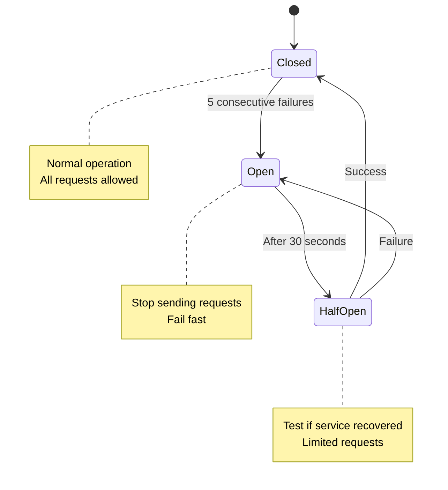

**Applied to**:
- All Typed HttpClients (Merret, External Systems)
- Prevents cascading failures
- Configured: 5 failures → open for 30 seconds

### 7.3 Dead Letter Queue Handling

**Triggers for DLQ**:
- Max delivery count exceeded (5 attempts)
- Message processing timeout
- Unhandled exceptions

**DLQ Processing**:
- Monitor DLQ depth (alert if > 10 messages)
- Manual review and retry
- Store in error table for investigation

---

## 8. Security Architecture

### 8.1 Authentication & Authorization

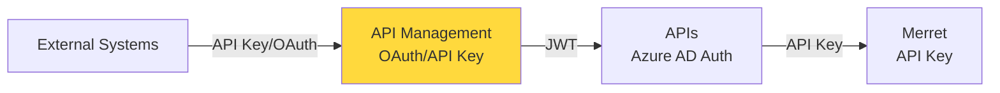

| Layer | Method | Details |
|-------|--------|---------|
| **External → APIM** | API Key or OAuth 2.0 | Per-client credentials |
| **APIM → APIs** | JWT (Azure AD) | Managed Identity |
| **APIs → Merret** | API Key | Stored in Key Vault |
| **APIs → External** | API Key | Stored in Key Vault |

### 8.2 Secrets Management

**All secrets stored in Azure Key Vault**:
- Merret API key
- Ecom API key
- Farfetch API credentials
- Enactor SFTP credentials
- Enactor API key
- Hospitality API key
- Service Bus connection strings
- Cosmos DB keys
- Storage account keys

**Access**:
- Container Apps/Functions use Managed Identity
- No secrets in code or configuration files
- Automatic rotation supported

### 8.3 Network Security

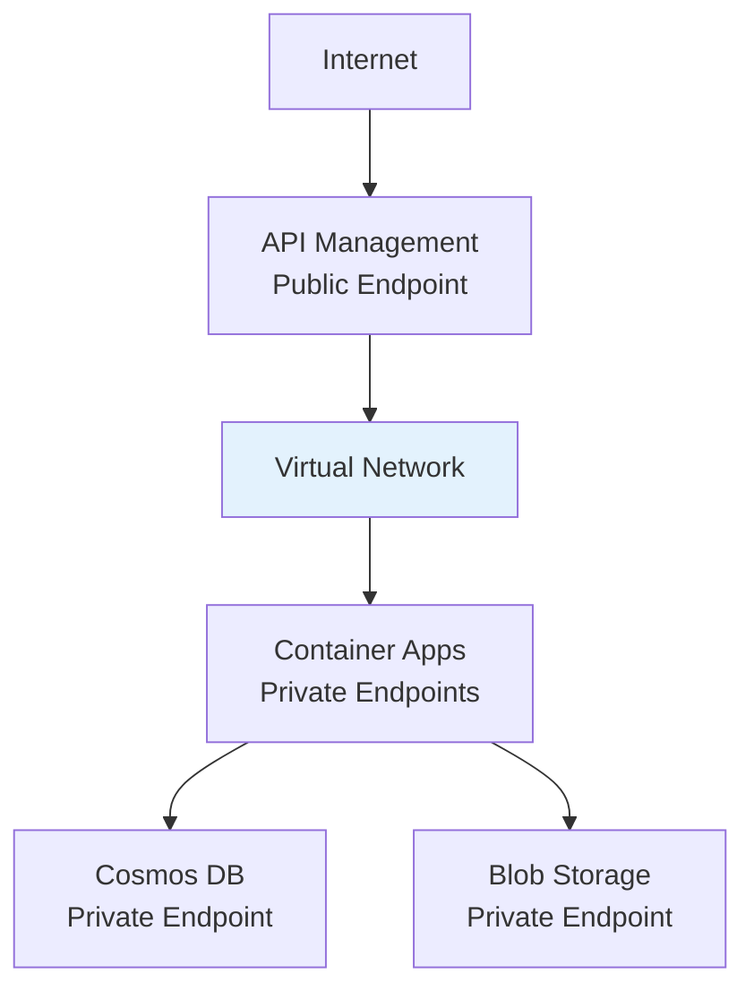

**Recommendations**:
- API Management in VNet
- Container Apps with private endpoints
- Cosmos DB with private endpoint
- Blob Storage with private endpoint
- NSGs to restrict traffic

---

## 9. Monitoring & Observability

### 9.1 Distributed Tracing

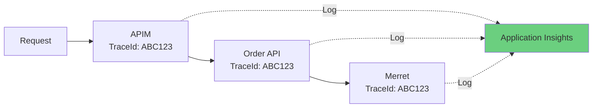

**Correlation ID flows through**:
- API Management
- Order/Transaction/Product APIs
- Azure Functions
- External system calls
- Logged to Application Insights

### 9.2 Key Metrics

#### API Metrics
- Request rate (requests/second)
- Response time (P50, P95, P99)
- Error rate (4xx, 5xx)
- Success rate (%)
- Dependency call duration

#### Function Metrics
- Execution count
- Execution duration
- Failure count
- Dead letter queue depth

#### Service Bus Metrics
- Active message count
- Dead letter message count
- Incoming/outgoing messages
- Message throughput

#### Cosmos DB Metrics
- Request units consumed
- Throttling (429 errors)
- Document count
- Storage used

### 9.3 Alerts Configuration

| Priority | Metric | Threshold | Action |
|----------|--------|-----------|--------|
| **Critical** | Service Bus DLQ | > 10 messages | PagerDuty + Email |
| **Critical** | API Error Rate | > 5% | PagerDuty + Email |
| **Critical** | Merret API Down | Circuit breaker open | PagerDuty + Email |
| **High** | Function Failures | > 10/hour | Email |
| **High** | API Response Time | P95 > 2s | Email |
| **Medium** | Cosmos DB Throttling | Any 429 errors | Email |
| **Medium** | Container App CPU | > 80% | Email + Auto-scale |

### 9.4 Dashboards

**Operations Dashboard**:
- Real-time request rates per API
- Error rates and types
- Dependency health (Merret, External Systems)
- Service Bus queue depths
- Function execution counts

**Business Dashboard**:
- Orders processed (by source: Ecom, Farfetch)
- Transactions processed (by source: Enactor, Farfetch, Hospitality)
- Price updates distributed
- Success/failure rates per integration

---

## 10. Scaling Strategy

### 10.1 Auto-Scaling Configuration

| Service | Min | Max | Scale Trigger | Scale-Out | Scale-In |
|---------|-----|-----|---------------|-----------|----------|
| **Order API** | 2 | 10 | CPU > 70% OR HTTP Queue > 100 | Add 1 instance | Remove after 5 min idle |
| **Transaction API** | 1 | 5 | HTTP Queue > 50 | Add 1 instance | Remove after 5 min idle |
| **Product API** | 1 | 5 | CPU > 60% | Add 1 instance | Remove after 5 min idle |
| **Price Worker** | 1 | 1 | N/A (singleton) | N/A | N/A |
| **Product Enhancement Worker** | 1 | 1 | N/A (singleton) | N/A | N/A |
| **Functions** | 0 | 10/5 | Queue length | Auto | Auto |

### 10.2 Performance Targets

| Service | Target Latency | Target Throughput |
|---------|----------------|-------------------|
| **Order API** | < 500ms (P95) | 1000 req/min |
| **Transaction API** | < 1s (P95) | 500 req/min |
| **Product API** | < 300ms (P95) | 200 req/min |
| **Price Distribution** | N/A (async) | 10,000 prices/cycle |
| **Product Enhancement Distribution** | N/A (async) | 50,000 products/day |

---

## 11. Cost Optimization

### 11.1 Cost Estimates (Monthly)

| Service | Tier | Estimated Cost | Notes |
|---------|------|----------------|-------|
| **Container Apps** | Consumption | $100-350 | Scales to zero, +1 worker |
| **Azure Functions** | Consumption | $50-180 | Pay per execution, +1 function |
| **Service Bus** | Standard | $10 | +1 topic (3 topics total) |
| **Cosmos DB** | Autoscale | $50-200 | 400-4000 RU/s |
| **Blob Storage** | Hot | $20-50 | Transaction files |
| **API Management** | Developer/Standard | $50-700 | Start with Developer |
| **Application Insights** | Pay-as-you-go | $50-100 | Based on data ingestion |
| **Key Vault** | Standard | $5 | Secrets storage |
| **Data Factory** | Pay-as-you-go | $20-50 | Based on executions |
| **Total** | | **$360-1630/month** | |

### 11.2 Cost Optimization Strategies

1. **Functions**: Use Consumption plan (pay per execution)
2. **Container Apps**: Scale to zero for low-traffic services
3. **Service Bus**: Start with Standard tier
4. **Cosmos DB**: Use autoscale (lower bound 400 RU/s)
5. **Blob Storage**: Move old files to Cool/Archive tier
6. **API Management**: Start with Developer tier
7. **Monitoring**: Tune sampling rate in Application Insights

---

## 12. Deployment Strategy

### 12.1 CI/CD Pipeline

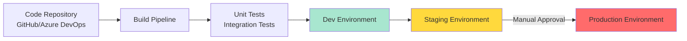

### 12.2 Environment Strategy

| Environment | Purpose | Deployment | Data |
|-------------|---------|------------|------|
| **Dev** | Development | Automatic on commit | Mock/synthetic |
| **Staging** | Pre-production testing | Automatic after Dev | Anonymized production data |
| **Production** | Live system | Manual approval | Live data |

### 12.3 Deployment Order

1. **Infrastructure** (Azure resources via Bicep/Terraform)
2. **Secrets** (Key Vault)
3. **Functions** (Pollers, Transformers, Senders)
4. **APIs** (Order, Transaction, Product)
5. **Workers** (Price Distribution)
6. **ADF Pipelines**
7. **APIM Policies**
8. **Monitoring** (Alerts, Dashboards)

---

## 13. Disaster Recovery

### 13.1 Backup Strategy

| Component | Backup Method | Frequency | Retention |
|-----------|---------------|-----------|-----------|
| **Cosmos DB** | Automatic + Manual | Continuous | 30 days |
| **Blob Storage** | Geo-redundant | Continuous | 90 days |
| **Service Bus** | Geo-replication (Premium) | Continuous | N/A |
| **Configuration** | Source control | Every commit | Forever |
| **Secrets** | Key Vault backup | Daily | 90 days |

### 13.2 Recovery Time Objectives

| Scenario | RTO | RPO | Action |
|----------|-----|-----|--------|
| **API Failure** | < 5 min | 0 | Auto-restart, health checks |
| **Function Failure** | < 5 min | 0 | Auto-retry, DLQ processing |
| **Region Outage** | < 4 hours | < 1 hour | Failover to secondary region |
| **Data Corruption** | < 2 hours | < 1 hour | Restore from Cosmos backup |

### 13.3 High Availability

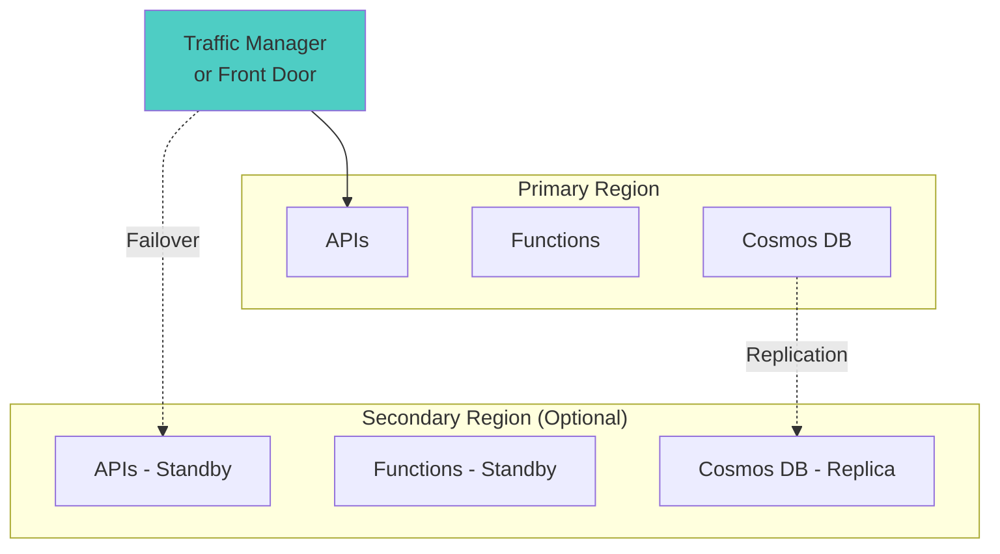

**Options**:
- **Active-Passive**: Primary region active, secondary on standby
- **Active-Active**: Both regions serve traffic (more expensive)
- **Multi-region Cosmos DB**: Automatic replication

---

## 14. Technology Stack

### 14.1 Languages & Frameworks

```yaml
Primary Language: C# (.NET 8)

Frameworks:
  - ASP.NET Core 8 (Web APIs)
  - Azure Functions .NET 8 Isolated Worker
  - Minimal APIs
  
Key Libraries:
  - Azure.Messaging.ServiceBus (Service Bus SDK)
  - Azure.Storage.Blobs (Blob SDK)
  - Microsoft.Azure.Cosmos (Cosmos DB SDK)
  - Microsoft.Extensions.Http (Typed HttpClient)
  - Polly (Resilience & transient fault handling)
  - System.Text.Json (Serialization)
  - Serilog (Structured logging)
  - FluentValidation (Input validation)
```

### 14.2 Azure Services

```yaml
Compute:
  - Azure Container Apps (APIs, Workers)
  - Azure Functions (Consumption Plan)
  - Azure App Service (alternative to Container Apps)

Storage:
  - Azure Blob Storage (Transaction files)
  - Azure Cosmos DB (NoSQL, reporting)

Messaging:
  - Azure Service Bus (Queues, Topics)
  - Azure Event Grid (Event routing)

Integration:
  - Azure Data Factory (ETL pipelines)
  - Azure API Management (API Gateway)

Security:
  - Azure Key Vault (Secrets management)
  - Azure Active Directory (Authentication)

Monitoring:
  - Application Insights (APM)
  - Azure Monitor (Metrics, Logs, Alerts)
  - Log Analytics (Query & analysis)
```

### 14.3 Development Tools

```yaml
IDE: Visual Studio Code / Visual Studio 2022
Source Control: Git (GitHub or Azure DevOps)
CI/CD: Azure DevOps Pipelines or GitHub Actions
IaC: Bicep or Terraform
API Testing: Postman, REST Client
Load Testing: Azure Load Testing, k6
Monitoring: Azure Portal, Grafana (optional)
```

---

## 15. API Contracts

### 15.1 Order API

#### POST /api/orders
```json
Request:
{
  "orderId": "ORD-12345",
  "customerId": "CUST-789",
  "orderDate": "2026-01-07T10:30:00Z",
  "items": [
    {
      "productId": "PROD-001",
      "quantity": 2,
      "price": 29.99,
      "total": 59.98
    }
  ],
  "totalAmount": 59.98,
  "currency": "USD",
  "sourceSystem": "Ecom"
}

Response (200 OK):
{
  "orderId": "ORD-12345",
  "merretOrderId": "MER-67890",
  "status": "Created"
}
```

#### POST /api/orders/{id}/cancel
```json
Request:
{
  "reason": "Customer requested",
  "source": "Farfetch"
}

Response (200 OK):
{
  "orderId": "ORD-12345",
  "status": "Cancelled"
}
```

### 15.2 Transaction API

#### POST /api/transactions
```json
Request:
{
  "id": "TXN-12345",
  "amount": 150.50,
  "date": "2026-01-07T15:45:00Z",
  "type": "Sale",
  "customerId": "CUST-789",
  "sourceSystem": "Enactor",
  "metadata": {
    "storeId": "STORE-001",
    "terminalId": "POS-05"
  }
}

Response (200 OK):
{
  "transactionId": "TXN-12345",
  "merretTransactionId": "MTXN-98765",
  "status": "Success"
}
```

### 15.3 Product API

#### GET /api/products/{id}
```json
Response (200 OK):
{
  "productId": "PROD-001",
  "name": "Blue Widget",
  "sku": "SKU-12345",
  "price": 29.99,
  "currency": "USD",
  "stock": 150,
  "category": "Widgets",
  "lastUpdated": "2026-01-07T12:00:00Z"
}
```

#### POST /api/products
```json
Request:
{
  "name": "New Widget",
  "sku": "SKU-67890",
  "price": 39.99,
  "currency": "USD",
  "category": "Widgets",
  "description": "A brand new widget"
}

Response (201 Created):
{
  "productId": "PROD-002",
  "status": "Created"
}
```

---

## 16. Testing Strategy

### 16.1 Test Pyramid

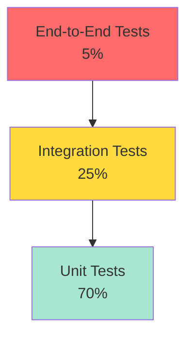

### 16.2 Test Coverage

| Layer | Type | Coverage | Tools |
|-------|------|----------|-------|
| **Unit Tests** | Logic, transformations | 70%+ | xUnit, NUnit, Moq |
| **Integration Tests** | API contracts, DB | 25% | WebApplicationFactory, Testcontainers |
| **E2E Tests** | Full flow | 5% | Playwright, Postman |
| **Load Tests** | Performance | Key scenarios | Azure Load Testing, k6 |

### 16.3 Key Test Scenarios

1. **Order Flow**
   - Ecom order → Order API → Merret
   - Farfetch poller → Order API → Merret
   - Farfetch cancellation flow

2. **Transaction Flow**
   - SFTP file → Transform → Transaction API → Merret + Cosmos
   - Hospitality poller → Transaction API → Merret + Cosmos

3. **Price Flow**
   - Price worker → Service Bus → Enactor/Ecom
   - Error handling and retry

4. **Resilience**
   - Circuit breaker activation
   - Service Bus retry and DLQ
   - API timeout handling

---

## 17. Future Enhancements

### 17.1 Planned Improvements

| Enhancement | Priority | Timeline | Benefit |
|-------------|----------|----------|---------|
| **Real-time Events** | Medium | Q2 2026 | Replace polling with webhooks |
| **GraphQL API** | Low | Q3 2026 | Flexible queries for clients |
| **Machine Learning** | Low | Q4 2026 | Demand forecasting, anomaly detection |
| **Multi-region** | Medium | Q2 2026 | High availability |
| **API Versioning** | High | Q1 2026 | Backwards compatibility |

### 17.2 Potential Optimizations

1. **Replace Polling with Webhooks**
   - Farfetch → Push orders via webhook
   - Hospitality → Push transactions via webhook
   - Reduces latency, more real-time

2. **Batch Processing**
   - Process multiple transactions in single API call
   - Improves throughput

3. **Caching Layer**
   - Add Redis for frequently accessed products/prices
   - Reduce Merret API calls

4. **Event Sourcing**
   - Store all state changes as events
   - Better audit trail and replay capability

---

## 18. Glossary

| Term | Definition |
|------|------------|
| **Merret** | Third-party core inventory system |
| **Ecom** | E-commerce system (direct API integration) |
| **Farfetch** | Fashion marketplace (API polling + SFTP) |
| **Enactor** | Retail management system (SFTP + price destination) |
| **Hospitality** | Hospitality management system (API polling) |
| **PIM** | Product Information Management system (product enhancement destination) |
| **SFTP** | Secure File Transfer Protocol |
| **ADF** | Azure Data Factory |
| **APIM** | Azure API Management |
| **DLQ** | Dead Letter Queue |
| **RTO** | Recovery Time Objective |
| **RPO** | Recovery Point Objective |
| **RU/s** | Request Units per second (Cosmos DB) |

---

## Appendix A: Configuration Templates

### A.1 appsettings.json (Order API)

```json
{
  "Logging": {
    "LogLevel": {
      "Default": "Information",
      "Microsoft.AspNetCore": "Warning"
    }
  },
  "Merret": {
    "BaseUrl": "https://merret-api.example.com",
    "ApiKey": "stored-in-keyvault",
    "Timeout": 30
  },
  "ApplicationInsights": {
    "ConnectionString": "stored-in-keyvault"
  },
  "KeyVault": {
    "VaultUri": "https://your-keyvault.vault.azure.net/"
  }
}
```

### A.2 local.settings.json (Azure Function)

```json
{
  "IsEncrypted": false,
  "Values": {
    "AzureWebJobsStorage": "UseDevelopmentStorage=true",
    "FUNCTIONS_WORKER_RUNTIME": "dotnet-isolated",
    "ServiceBusConnection": "Endpoint=sb://...",
    "BlobConnection": "DefaultEndpointsProtocol=https;...",
    "TransactionAPI__BaseUrl": "https://transaction-api.azure.io",
    "TransactionAPI__ApiKey": "your-api-key",
    "APPINSIGHTS_INSTRUMENTATIONKEY": "your-key"
  }
}
```

---

## Appendix B: Useful Commands

### B.1 Azure CLI Commands

```bash
# Create Resource Group
az group create --name rg-integration-hub --location eastus

# Create Service Bus
az servicebus namespace create --name sb-integration-hub --resource-group rg-integration-hub

# Create Cosmos DB
az cosmosdb create --name cosmos-integration-hub --resource-group rg-integration-hub

# Create Key Vault
az keyvault create --name kv-integration-hub --resource-group rg-integration-hub

# Create Container App Environment
az containerapp env create --name env-integration-hub --resource-group rg-integration-hub --location eastus
```

### B.2 Monitoring Queries (KQL)

```kql
// API Request Rate
requests
| where timestamp > ago(1h)
| summarize RequestCount = count() by bin(timestamp, 5m), name
| render timechart

// Error Rate
requests
| where timestamp > ago(1h)
| summarize TotalRequests = count(), FailedRequests = countif(success == false) by name
| extend ErrorRate = FailedRequests * 100.0 / TotalRequests
| project name, ErrorRate

// Dependency Call Duration
dependencies
| where timestamp > ago(1h)
| summarize avg(duration), percentile(duration, 95) by target
```

---

## Appendix C: Migration Journey - Legacy to Microservices

### C.1 Legacy Architecture Overview

```mermaid
flowchart TB
    subgraph LEGACY["🏢 LEGACY MONOLITHIC SYSTEMS (On-Premises)"]
        direction TB
        
        subgraph OFS["Order Fulfillment System (OFS)"]
            direction TB
            OFS_UI["UI Layer<br/><i>Monolithic Web App</i>"]
            OFS_API["API Layer<br/><i>Tightly Coupled</i>"]
            OFS_DB[("OFS SQL Database")]
            OFS_PROC["Processing Engine<br/><i>In-house</i>"]
            
            OFS_UI --> OFS_API
            OFS_API --> OFS_DB
            OFS_API --> OFS_PROC
        end
        
        subgraph PMS["Product Management System"]
            direction TB
            PMS_UI["UI Layer<br/><i>Monolithic Web App</i>"]
            PMS_API["API Layer<br/><i>Tightly Coupled</i>"]
            PMS_DB[("PMS SQL Database")]
            PMS_PROC["Processing Engine<br/><i>In-house</i>"]
            
            PMS_UI --> PMS_API
            PMS_API --> PMS_DB
            PMS_API --> PMS_PROC
        end
    end
    
    CACHE_DB[("Merret Cache DB<br/><i>Separate Cache</i>")]
    MERRET[("Merret Core System<br/><i>3rd Party Inventory</i>")]
    
    OFS_API <-->|"Direct Interaction"| CACHE_DB
    PMS_API <-->|"Direct Interaction"| CACHE_DB
    CACHE_DB <-->|"Sync"| MERRET
    
    style LEGACY fill:#ffebee,stroke:#c62828,stroke-width:3px
    style OFS fill:#fff3e0,stroke:#e65100,stroke-width:2px
    style PMS fill:#e3f2fd,stroke:#1565c0,stroke-width:2px
    style CACHE_DB fill:#fff9c4,stroke:#f57f17,stroke-width:2px
    style MERRET fill:#ff6b6b,stroke:#333,stroke-width:4px
```

#### Legacy System Challenges

**Order Fulfillment System (OFS)**:
- ❌ Monolithic architecture - difficult to scale specific components
- ❌ Tight coupling between UI, API, and processing layers
- ❌ In-house processing limited by server capacity
- ❌ Merret cache database added complexity and sync issues
- ❌ Single point of failure
- ❌ Difficult to deploy updates without full system downtime

**Product Management System**:
- ❌ Similar monolithic constraints
- ❌ Redundant cache database management
- ❌ Scaling required scaling entire application
- ❌ Limited integration capabilities with third parties
- ❌ Manual deployment processes

**Integration Challenges**:
- ❌ Cache database became bottleneck
- ❌ Cache synchronization issues led to data inconsistencies
- ❌ No event-driven patterns - polling-based updates
- ❌ No retry mechanisms or dead-letter queues
- ❌ Limited observability and monitoring

---

### C.2 Migration to Microservices

#### Key Architectural Changes

| Aspect | Legacy | Current (Microservices) |
|--------|--------|-------------------------|
| **Architecture** | Monolithic | Microservices with domain boundaries |
| **Data Access** | Cache DB → Merret | Direct Merret DB queries + Cosmos DB for reporting |
| **Deployment** | On-premises servers | Azure Container Apps + Functions (PaaS) |
| **Scaling** | Vertical (entire app) | Horizontal (per service, auto-scale) |
| **Integration** | Direct DB calls | Event-driven (Event Grid + Service Bus) |
| **Processing** | Synchronous, in-house | Asynchronous, distributed |
| **Resilience** | Single point of failure | Retry policies, DLQ, circuit breakers |
| **Monitoring** | Limited logs | Application Insights, distributed tracing |
| **Third Parties** | Minimal | Deep integration (Ecom, Farfetch, Enactor, PIM) |

#### Migration Benefits Achieved

✅ **Eliminated Cache DB**: Direct queries to Merret with proper caching strategies  
✅ **Independent Scaling**: Each service scales based on its load  
✅ **Event-Driven**: Blob uploads trigger processing automatically (Event Grid → Service Bus → Functions)  
✅ **Fault Tolerance**: Service Bus dead-letter queues prevent message loss  
✅ **Cloud-Native**: Leveraging Azure PaaS reduces operational overhead  
✅ **Third-Party Integration**: Seamless integration with external systems  
✅ **Observability**: End-to-end tracing with Application Insights  
✅ **Batch Processing**: Efficient handling of large data volumes  

---

### C.3 File Processing Pattern (Example: Blob → Service Bus → Function)

This pattern replaced the legacy polling-based approach:

```mermaid
sequenceDiagram
    participant SFTP as 3rd Party SFTP
    participant ADF as Azure Data Factory
    participant Blob as Blob Storage
    participant EG as Event Grid
    participant SB as Service Bus Queue
    participant Func as Azure Function
    participant DLQ as Dead Letter Queue
    participant API as Transaction API
    participant DB as Merret DB

    SFTP->>ADF: 1. Files uploaded to SFTP
    ADF->>Blob: 2. Copy files to Blob Storage
    Blob->>EG: 3. Blob Created Event
    
    Note over EG: Event Grid System Topic<br/>Filter: *.csv files only
    
    EG->>SB: 4. Send to Service Bus Queue
    
    Note over SB: Service Bus provides:<br/>- Durability<br/>- Retry policies<br/>- Dead-letter queue
    
    SB->>Func: 5. Trigger Azure Function
    
    alt Success
        Func->>Blob: 6a. Read file
        Func->>Func: 6b. Transform data
        Func->>API: 6c. POST to Transaction API
        API->>DB: 6d. Write to Merret DB
        Func-->>SB: 6e. Complete message
    else Processing Failure
        Func--xSB: 6f. Abandon message
        SB->>Func: 6g. Retry (up to max attempts)
    else Max Retries Exceeded
        SB->>DLQ: 6h. Move to Dead Letter Queue
        DLQ->>Func: 6i. DLQ Processor alerts Ops team
    end
    
    Note over DLQ,Func: DLQ Function handles:<br/>- Alerts<br/>- Logging<br/>- Manual reprocessing
```

**Key Improvements over Legacy**:
- **Event-Driven**: No more polling, instant processing on file arrival
- **Fault Tolerance**: Service Bus ensures no message loss
- **Retry Mechanism**: Automatic retries with exponential backoff
- **Observability**: Full tracing from blob upload to DB write
- **Scalability**: Functions scale automatically based on queue depth

---

### C.4 Recommended Azure Function Plan

Based on the file processing workload:

**✅ Recommended: Consumption Plan** (for most scenarios)
- **Pricing**: Pay per execution + execution time
- **Scaling**: Automatic (0 to 200+ instances)
- **Timeout**: 5 minutes default, up to 10 minutes configurable
- **Best for**: Variable/unpredictable workloads, cost optimization
- **Cold starts**: Yes (~1-3 seconds for .NET)

**When to use Premium Plan**:
- ⚡ Need longer execution time (>10 minutes)
- 🔒 Require VNet integration for secure DB access
- 🚀 Cannot tolerate cold starts (pre-warmed instances)
- 📊 Sustained high throughput (predictable load)

**Current Setup Recommendation**:
```
Functions: Consumption Plan
- Farfetch Order Poller
- Hospitality TX Poller
- TX Transformer (Service Bus trigger)
- Price Batch Sender
- Product Batch Sender
- DLQ Processor

Container Apps: Always-on
- Order API (2-10 replicas)
- Transaction API (1-5 replicas)
- Product API (1-5 replicas)
- Batch Workers (1-2 replicas)
```

---

### C.5 Event Grid Configuration Best Practices

**System Topic Setup** (for Blob Storage events):

```json
{
  "properties": {
    "source": "/subscriptions/{sub}/resourceGroups/{rg}/providers/Microsoft.Storage/storageAccounts/{account}",
    "topicType": "Microsoft.Storage.StorageAccounts",
    "destination": {
      "endpointType": "ServiceBusQueue",
      "properties": {
        "resourceId": "/subscriptions/{sub}/resourceGroups/{rg}/providers/Microsoft.ServiceBus/namespaces/{namespace}/queues/{queue}"
      }
    },
    "filter": {
      "subjectBeginsWith": "/blobServices/default/containers/raw-files/",
      "subjectEndsWith": ".csv",
      "includedEventTypes": [
        "Microsoft.Storage.BlobCreated"
      ],
      "advancedFilters": [
        {
          "operatorType": "StringEquals",
          "key": "data.api",
          "values": ["PutBlob", "FlushWithClose"]
        }
      ]
    },
    "retryPolicy": {
      "maxDeliveryAttempts": 30,
      "eventTimeToLiveInMinutes": 1440
    }
  }
}
```

**Key Configuration Points**:
- ✅ **Filter at Event Grid**: Only send events for relevant files (*.csv, specific containers)
- ✅ **Advanced Filters**: Exclude temporary files from ADF (filter by API type)
- ✅ **Retry Policy**: 30 attempts over 24 hours before dropping
- ✅ **Dead-Letter Destination**: Configure blob container for failed events
- ✅ **Managed Identity**: Use managed identity for Service Bus authentication

**Event Schema Example**:
```json
{
  "topic": "/subscriptions/{sub}/resourceGroups/{rg}/providers/Microsoft.Storage/storageAccounts/{account}",
  "subject": "/blobServices/default/containers/raw-files/blobs/transactions_2026-01-08.csv",
  "eventType": "Microsoft.Storage.BlobCreated",
  "eventTime": "2026-01-08T10:30:00.0000000Z",
  "data": {
    "api": "PutBlob",
    "clientRequestId": "...",
    "requestId": "...",
    "eTag": "...",
    "contentType": "text/csv",
    "contentLength": 245678,
    "blobType": "BlockBlob",
    "url": "https://{account}.blob.core.windows.net/raw-files/transactions_2026-01-08.csv"
  }
}
```

---

### C.6 Service Bus Configuration for Reliability

**Queue Settings** (transaction-queue):

```json
{
  "maxDeliveryCount": 10,
  "lockDuration": "PT5M",
  "requiresDuplicateDetection": true,
  "duplicateDetectionHistoryTimeWindow": "PT10M",
  "deadLetteringOnMessageExpiration": true,
  "defaultMessageTimeToLive": "P1D",
  "maxSizeInMegabytes": 1024,
  "enablePartitioning": false,
  "enableBatchedOperations": true
}
```

**Why Service Bus over Direct Event Grid → Function**:
- ✅ **Persistent Dead-Letter Queue**: Failed messages preserved for investigation
- ✅ **Configurable Retry**: Control over delivery attempts and backoff
- ✅ **Message Durability**: Messages persisted to storage (not lost on failure)
- ✅ **At-Least-Once Delivery**: Guaranteed processing
- ✅ **Poison Message Handling**: Automatic DLQ after max retries
- ✅ **Message Ordering**: FIFO with sessions (if needed)
- ✅ **Deferred Processing**: Manual message management for complex scenarios

**DLQ Processing Strategy**:

```mermaid
flowchart TB
    DLQ[Dead Letter Queue]
    DLQFUNC[DLQ Processor Function<br/><i>Timer: Every 5 min</i>]
    
    subgraph Analysis
        CHECK{Analyze Error}
    end
    
    subgraph Actions
        ALERT[Send Alert<br/><i>Teams/Email</i>]
        LOG[Log to App Insights<br/><i>Full context</i>]
        STORE[Store in Cosmos DB<br/><i>Failed messages table</i>]
        REQUEUE[Requeue to main queue<br/><i>If transient error</i>]
        MANUAL[Flag for manual review<br/><i>Create ticket</i>]
    end
    
    DLQ --> DLQFUNC
    DLQFUNC --> CHECK
    
    CHECK -->|Transient Error<br/>Network/Timeout| REQUEUE
    CHECK -->|Data Quality Issue| MANUAL
    CHECK -->|System Error| ALERT
    
    CHECK --> LOG
    CHECK --> STORE
    
    style DLQ fill:#ff6b6b,stroke:#333,stroke-width:3px
    style DLQFUNC fill:#f3e5f5,stroke:#6a1b9a,stroke-width:2px
    style REQUEUE fill:#4caf50,stroke:#333,stroke-width:2px
    style MANUAL fill:#ff9800,stroke:#333,stroke-width:2px
    style ALERT fill:#f44336,stroke:#333,stroke-width:2px
```

---

## Appendix D: Cost Optimization Strategies

### D.1 Azure Function Consumption Plan Costs

**Pricing Model** (as of Jan 2026):
- **Execution Count**: $0.20 per million executions
- **Execution Time**: $0.000016 per GB-second
- **Free Grant**: 1M executions + 400,000 GB-seconds per month

**Example Cost Calculation** (File Processing):
```
Scenario: 10,000 files/month, avg 2 seconds processing, 512MB memory

Executions: 10,000 = $0.002
GB-seconds: 10,000 × 2s × 0.5GB = 10,000 GB-s = $0.16
Total: ~$0.17/month

Compare to Premium Plan: ~$168/month (cheapest tier)
Savings: ~$167.83/month (99% reduction)
```

### D.2 Service Bus Cost Optimization

**Standard Tier vs Premium Tier**:

| Feature | Standard | Premium |
|---------|----------|---------|
| **Base Cost** | $0.05 per million ops | $677/month (1 MU) |
| **Message Size** | 256 KB | 1 MB |
| **VNet** | No | Yes |
| **Throughput** | Variable | Dedicated (1000 msg/s) |
| **Best For** | Variable loads | Predictable high loads |

**Recommendation**: Start with **Standard Tier** unless:
- Need VNet integration
- Message sizes >256KB consistently
- Predictable sustained high throughput

---

## Document Control

| Version | Date | Author | Changes |
|---------|------|--------|---------|
| 1.0 | 2026-01-07 | Architecture Team | Initial version |
| 1.1 | 2026-01-08 | Architecture Team | Added legacy migration details, Event Grid/Service Bus config, DLQ strategies |

---

**END OF DOCUMENT**
